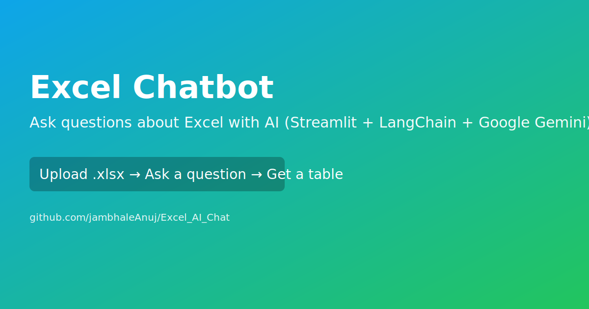

<!--
  SEO: This README intentionally includes clear, keyword-rich headings and content
  to improve discoverability for searches like: Excel chatbot, Excel AI chat,
  LangChain CSV agent, Streamlit Excel Q&A, Google Gemini Excel assistant,
  ask questions about Excel, talk to Excel, analyze spreadsheet with AI.
-->

# Excel Chatbot (Streamlit + LangChain + Google Gemini)

[](https://github.com/jambhaleAnuj/Excel_AI_Chat/stargazers)
[](https://github.com/jambhaleAnuj/Excel_AI_Chat/actions/workflows/ci.yml)
[](https://github.com/jambhaleAnuj/Excel_AI_Chat/issues)
[](./LICENCE)
[](https://www.python.org/)
[](https://streamlit.io)
[](https://python.langchain.com)



Ask questions about your Excel spreadsheets using natural language. Upload a .xlsx file and get answers as clean tables or summaries. The app uses LangChain CSV agents powered by Google Gemini to understand your data—including targeted Q&A over Comments/Feedback columns.

> Looking for: Excel chatbot, Excel Q&A, talk to Excel, query Excel with AI, spreadsheet assistant, CSV agent, Streamlit chatbot for Excel.

---

## Demo


Optional: Deploy on Streamlit Cloud

[](https://share.streamlit.io/)

---

## Table of Contents

- Overview
- Features
- Quickstart
- Configuration (API Key)
- Usage Examples
- How it Works
- Troubleshooting
- FAQ
- Contributing
- License

---

## Overview

Excel Chatbot is a lightweight Streamlit web app that lets you chat with your Excel data. It:

- accepts Excel (.xlsx) uploads
- answers questions in plain English
- returns results as tables when you ask for lists/filters
- can focus specifically on a Comments column for feedback analysis

This project is ideal for analysts, HR/PeopleOps, and teams who need quick insights from spreadsheets without writing formulas.

---

## Features

- Upload Excel files (.xlsx)
- Natural-language questions ("Show all employees in Sales")
- Structured results (CSV/table) when requested
- Comments/Feedback-aware queries
- Chat history sidebar with delete/clear
- Works locally; no data leaves your machine except to the LLM provider

---

## Quickstart

1. Clone the repo

    ```powershell
    git clone https://github.com/jambhaleAnuj/Excel_AI_Chat.git
    cd Excel_AI_Chat
    ```

1. Create and activate a virtual environment (Windows PowerShell)

    ```powershell
    python -m venv .venv
    ./.venv/Scripts/Activate.ps1
    ```

1. Install dependencies

    ```powershell
    pip install -r requirements.txt
    ```

1. Configure your Google Generative AI key

    ```powershell
    $env:GOOGLE_API_KEY = "your-google-api-key"
    ```

1. Run the app

    ```powershell
    streamlit run app.py
    ```

Open the URL shown (usually [http://localhost:8501](http://localhost:8501)), upload an Excel file, and start asking questions.

---

## Configuration (API Key)

Get a key from Google AI Studio: <https://aistudio.google.com/app/apikey>

Set it via environment variable (recommended):

```powershell
$env:GOOGLE_API_KEY = "your-google-api-key"
```

Or configure Streamlit secrets (for deployment):

- .streamlit/secrets.toml

```toml
GOOGLE_API_KEY = "your-google-api-key"
```

---

## Usage Examples

- List employees in the Sales department.
- List the names of employees whose status is internal project (answer in table format).
- Show comments for employee Jane Smith (don’t truncate).
- Give a summary of feedback for the marketing team.

Tip: For tabular output, include phrases like “list”, “table”, “csv”, “show”, or “filter”.

---

## How it Works

- The app loads your Excel into pandas.
- It builds two LangChain CSV agents: one for the main data and one focused on the Comments column.
- A small prompt-engineering layer encourages the model to return CSV when your query asks for structured output.
- The app tries to parse CSV/table-like answers and renders them as a Streamlit dataframe. If the model replies in natural language, you’ll see it as chat text.

---

## Troubleshooting

- ModuleNotFoundError: Run `pip install -r requirements.txt`.
- API key issues: Ensure GOOGLE_API_KEY is set in your shell or Streamlit secrets.
- Excel read errors: Use .xlsx and ensure the file is not open elsewhere.
- Output looks like a single line but should be a table: Ask explicitly for “answer in table/csv format”. The app also auto-parses common single-column formats.

---

## FAQ

Q: Does my data get uploaded to the internet?

A: The file is processed locally, but your prompts and extracted context go to the LLM provider. Don’t use sensitive data.

Q: Can I use OpenAI or another LLM?

A: The code is structured around LangChain CSV agents. You can swap the model with a compatible LangChain chat model.

Q: How do I deploy?

A: You can deploy on Streamlit Community Cloud or any platform that runs Streamlit (ensure GOOGLE_API_KEY is configured as a secret).

---

## Contributing

Contributions are welcome! See CONTRIBUTING.md for how to report bugs, request features, and open pull requests.

If you find this useful:

- Star the repo to help others discover it
- Share it on social media or your team chat

---

## License

MIT — see LICENCE.

---

_Extra keywords to help search engines index relevant phrases:_

excel chatbot, excel ai, streamlit excel chatbot, talk to excel, query excel with ai, excel q&a, spreadsheet chatbot, csv agent, langchain excel, google gemini excel, hr feedback analysis excel, employee comments analysis, excel analytics ai, data assistant for excel
